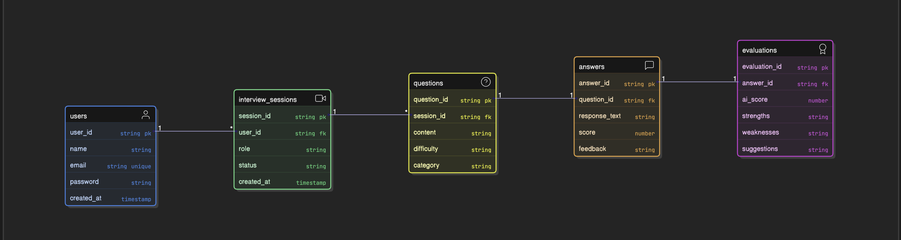

# Entity Relationship Diagram Documentation

This document describes the structure and relationships of the database entities as shown in `ERDiagram.png`.

## Entities and Attributes

### 1. users
Represents the users of the platform.
- **user_id** (string, Primary Key): Unique identifier for the user.
- **name** (string): Full name of the user.
- **email** (string, Unique): User's email address.
- **password** (string): Hashed password for authentication.
- **created_at** (timestamp): Date and time of account creation.

### 2. interview_sessions
Represents a specific interview session for a user.
- **session_id** (string, Primary Key): Unique identifier for the session.
- **user_id** (string, Foreign Key): Reference to the user who owns the session.
- **role** (string): The professional role being interviewed for.
- **status** (string): Current status of the session (e.g., active, completed).
- **created_at** (timestamp): Date and time the session was started.

### 3. questions
Represents the questions asked during an interview session.
- **question_id** (string, Primary Key): Unique identifier for the question.
- **session_id** (string, Foreign Key): Reference to the interview session.
- **content** (string): The text of the question.
- **difficulty** (string): Difficulty level (e.g., easy, medium, hard).
- **category** (string): Category of the question (e.g., technical, behavioral).

### 4. answers
Represents the student's responses to the questions.
- **answer_id** (string, Primary Key): Unique identifier for the answer.
- **question_id** (string, Foreign Key): Reference to the question being answered.
- **response_text** (string): The student's response.
- **score** (number): Initial score for the response.
- **feedback** (string): Qualitative feedback on the response.

### 5. evaluations
Represents AI-driven detailed evaluations of the answers.
- **evaluation_id** (string, Primary Key): Unique identifier for the evaluation.
- **answer_id** (string, Foreign Key): Reference to the specific answer being evaluated.
- **ai_score** (number): The score assigned by the AI.
- **strengths** (string): Key strengths identified in the response.
- **weaknesses** (string): Key weaknesses identified in the response.
- **suggestions** (string): Recommendations for improvement.

## Relationships

- **Users to Interview Sessions**: A one-to-many (1:*) relationship. One user can have multiple interview sessions.
- **Interview Sessions to Questions**: A one-to-many (1:*) relationship. One session consists of multiple questions.
- **Questions to Answers**: A one-to-one (1:1) relationship. Each question has a corresponding answer.
- **Answers to Evaluations**: A one-to-one (1:1) relationship. Each answer receives a detailed AI evaluation.
