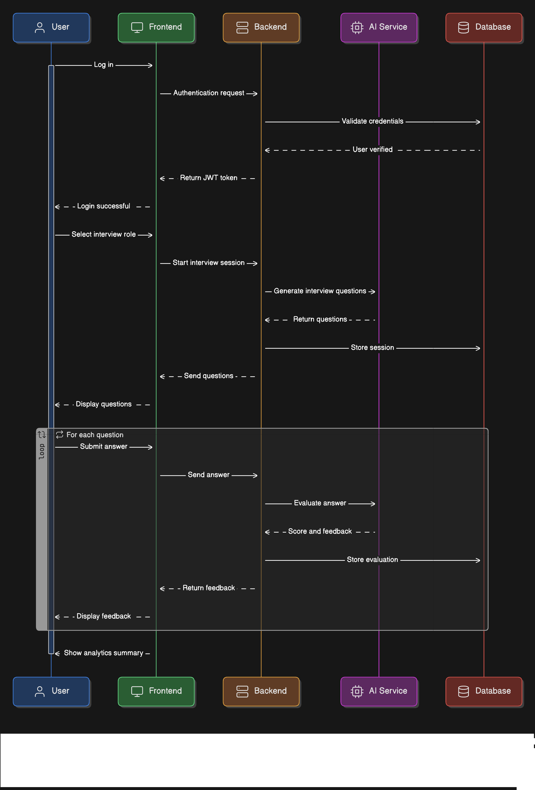

# Sequential Diagram Documentation

This document describes the interaction flow between the various system components as illustrated in `SequencialDiagram.png`.

## Participants

- **User**: The student interacting with the platform.
- **Frontend**: The user interface (React/Web).
- **Backend**: The central API server handling logic and orchestration.
- **AI Service**: The module responsible for question generation and evaluation (LLM-based).
- **Database**: The persistent storage for users, sessions, questions, and responses.

## Interaction Flows

### 1. Authentication Flow
This sequence describes how a user logs into the system.
1. **User** initiates a `Log in` request through the **Frontend**.
2. **Frontend** sends an `Authentication request` to the **Backend**.
3. **Backend** requests `Validate credentials` from the **Database**.
4. **Database** confirms the user and returns `User verified` to the **Backend**.
5. **Backend** issues a `JWT token` back to the **Frontend**.
6. **Frontend** notifies the **User** that `Login successful`.

### 2. Session Initialization Flow
This sequence occurs when a user starts a new interview session.
1. **User** selects a specific `interview role` (e.g., Software Engineer).
2. **Frontend** sends a `Start interview session` request to the **Backend**.
3. **Backend** communicates with the **AI Service** to `Generate interview questions` based on the role.
4. **AI Service** returns the generated questions to the **Backend**.
5. **Backend** executes `Store session` to persist the session details in the **Database**.
6. **Backend** sends the questions to the **Frontend**.
7. **Frontend** displays the questions to the **User**.

### 3. Interview Interaction (Looped per Question)
This sequence repeats for every question in the interview session.
1. **User** `Submits answer` for a question via the **Frontend**.
2. **Frontend** sends the `Send answer` request to the **Backend**.
3. **Backend** sends the answer to the **AI Service** for `Evaluate answer`.
4. **AI Service** analyzes the response and returns `Score and feedback` to the **Backend**.
5. **Backend** executes `Store evaluation` to save the results in the **Database**.
6. **Backend** returns the generated feedback to the **Frontend**.
7. **Frontend** displays the score and feedback to the **User**.

### 4. Completion
1. After all questions are answered, the system presents a comprehensive `Show analytics summary` to the **User**.
