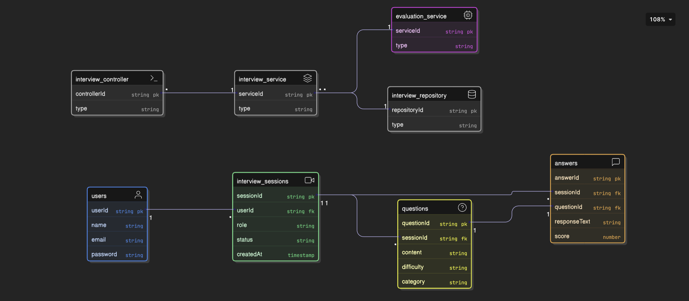

# Class Diagram Documentation

This document describes the software architecture and domain models as shown in `classDiagram.png`.

## Architectural Classes

These classes represent the different layers of the application's backend.

### 1. interview_controller
- **Responsibility**: Manages API endpoints and handles HTTP requests related to interviews.
- **Attributes**:
  - `controllerId` (string, PK): Unique identifier for the controller instance.
  - `type` (string): Type or version of the controller.
- **Relationships**: Interacts with the `interview_service`.

### 2. interview_service
- **Responsibility**: Implements core business logic for managing interview sessions and questions.
- **Attributes**:
  - `serviceId` (string, PK): Unique identifier for the service.
  - `type` (string): Service classification.
- **Relationships**: Coordinates with `evaluation_service` and `interview_repository`.

### 3. evaluation_service
- **Responsibility**: Interfaces with AI models to evaluate student responses.
- **Attributes**:
  - `serviceId` (string, PK): Unique identifier for the service.
  - `type` (string): AI model or service type.

### 4. interview_repository
- **Responsibility**: Handles low-level data access and persistence logic.
- **Attributes**:
  - `repositoryId` (string, PK): Unique identifier for the repository.
  - `type` (string): Storage type (e.g., SQL, NoSQL).

## Domain Model Classes

These classes represent the data structures used within the system.

### 1. users
- `userId` (string, PK): Unique ID for the user.
- `name` (string): User's name.
- `email` (string): User's email address.
- `password` (string): User's password (stored securely).

### 2. interview_sessions
- `sessionId` (string, PK): Unique ID for the session.
- `userId` (string, FK): Link to the user.
- `role` (string): Interviewed role.
- `status` (string): Current session status.
- `createdAt` (timestamp): Time of creation.

### 3. questions
- `questionId` (string, PK): Unique ID for the question.
- `sessionId` (string, FK): Link to the session.
- `content` (string): Question text.
- `difficulty` (string): Difficulty scale.
- `category` (string): Question category.

### 4. answers
- `answerId` (string, PK): Unique ID for the answer.
- `sessionId` (string, FK): Link to the session.
- `questionId` (string, FK): Link to the question.
- `responseText` (string): The user's input.
- `score` (number): Numerical score assigned.

## Class Relationships

- **Controller to Service**: The controller delegates logic to the service.
- **Service to Evaluation/Repository**: The service uses specialized components for AI processing and data persistence.
- **Domain Mappings**:
  - A `User` is associated with multiple `Interview Sessions`.
  - An `Interview Session` contains multiple `Questions` and `Answers`.
  - Each `Answer` is linked to a specific `Question`.
